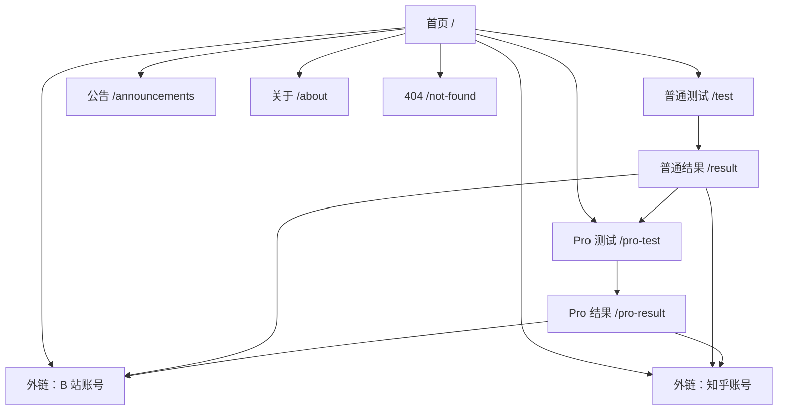
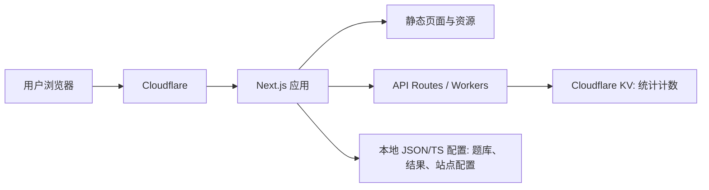

# 明清史爱好者检测器：需求设计与项目架构文档

版本：v0.2  
日期：2026-04-30  
参考站点：https://www.sbti.ai/、https://mingfen.fun/  
部署目标：Cloudflare

## 1. 项目概述

本项目是一个面向中文用户的历史圈层趣味测试网站，暂定名称为「XX 检测器」。网站借鉴 SBTI.ai 的轻量测试、结果标签、社交传播结构，同时参考 mingfen.fun 的明清史爱好者测试形态，将主题改造为「明清史爱好者身份检测 / 史观倾向测试 / 历史圈层梗传播工具」。

核心目标不是做严肃学术测评，而是通过有辨识度的问题、结果分层和分享文案制造传播，再在首页弹窗和关键结果页为站主的 B 站、知乎账号引流。

产品定位：

- 类型：历史爱好者趣味测试 / 圈层身份标签 / 社交分享工具
- 目标用户：中文互联网中的明史、清史、明清对比、历史剧、通俗历史内容爱好者
- 核心传播点：测试题有争议、有梗、能表达立场；结果称号适合截图、转发和互相调侃
- 核心转化点：首页弹窗、结果页关注入口、公告页和关于页导流至 B 站与知乎

站主账号：

- B 站：https://space.bilibili.com/23467654
- 知乎：https://www.zhihu.com/people/khg9ng
- 投稿邮箱：p1gpaw@qq.com

首页标语：

> 近代积贫积弱，朱元璋难辞其咎！----- 解雨泽熙

## 2. 命名与品牌

当前名称未定，建议先使用占位名：

- 「XX 检测器」
- 「明清史观检测器」
- 「明粉浓度检测器」
- 「大明精神状态检测器」
- 「明清立场鉴定器」

命名原则：

- 5 到 8 个中文字符优先，便于记忆和传播
- 标题要能直接表达测试主题
- 避免过强攻击性或人身标签，减少传播平台审核风险
- 页面 title 可使用「XX 检测器 - 测测你的明清史观浓度」

## 3. 用户与场景

目标用户：

- 明史、清史、明清对比内容消费者
- B 站、知乎、小红书、贴吧、微博等平台的历史内容受众
- 喜欢 MBTI、人格测试、阵营测试、浓度测试的泛娱乐用户
- 站主账号的潜在关注者

典型场景：

- 用户从社交平台看到测试链接，进入首页后开始测试
- 用户完成普通版测试，获得一个分数区间结果和分享文案
- 用户觉得普通版不够细，进入 Pro 测试查看四维画像
- 用户截图或复制结果分享到社交平台，引导更多人访问
- 用户在首页弹窗或结果页点击 B 站、知乎账号

## 4. 页面信息架构



## 5. 页面需求

### 5.1 首页

目标：快速说明网站是什么，推动用户开始测试，并向站主账号导流。

功能需求：

- 展示网站名称、短介绍、开始普通测试、开始 Pro 测试入口
- 首页展示一行标语：「近代积贫积弱，朱元璋难辞其咎！----- 解雨泽熙」
- 展示「已有 N 人完成测试」和各结果类型数量
- 首页弹窗展示 B 站和知乎账号，可关闭
- 弹窗关闭状态保存在浏览器本地，避免每次刷新都打扰用户
- 展示测试特色，例如「20 题完成」「无需登录」「结果可分享」「Pro 版四维画像」
- 展示公告入口
- 页脚展示关于页面、免责声明、站主账号链接

首页统计：

- 展示总测试人数
- 展示普通版各档位人数
- 可选展示 Pro 版四维结果的热门分布
- 统计数据不绑定用户身份，不保存答题明细

### 5.2 普通测试页

目标：让用户用较低门槛完成 20 题测试，获得一个分数区间结果。

功能需求：

- 默认 20 题
- 每题 4 个选项，或使用「是 / 否 / 不确定 / 跳过」等判断题形式
- 题目初稿由项目生成，站主后续校对
- 内容核心围绕「洪武型财政」和「宋进明退论」
- 展示当前进度，例如「第 8 / 20 题」
- 支持上一题、下一题
- 未选择时禁止进入下一题，或给出明确提示
- 完成后本地计算分数，并提交一条匿名统计事件
- 支持重新测试
- 支持移动端单手操作

普通版算法：

- 每个选项配置一个数值权重
- 用户总分为所有题目选项权重之和
- 按总分落入的区间返回结果
- 结果暂定三类：
  - 正常人：低分区间，对明清史观争议保持距离或兴趣较浅
  - 旧明粉：中分区间，对明代叙事有明显好感，但仍保留部分现实主义判断
  - 朱粉：高分区间，高度认同洪武型财政、明代制度辩护和宋进明未退的解释框架

### 5.3 Pro 测试页

目标：给深度用户更细的四维画像，提高二次传播和复访。

功能需求：

- 可复用普通版题库，也可使用独立 Pro 题库
- 题目仍建议控制在 20 题左右
- 题目初稿由项目生成，站主后续校对
- 题目内容继续以「洪武型财政」和「宋进明退论」为核心，但增加制度、财政、社会治理、历史叙事维度的拆分
- 每个选项映射到 4 个维度的分数
- 完成后展示四维雷达图或条形图
- 支持从普通结果页进入 Pro 测试
- 支持复制 Pro 结果文案

建议四维模型：

- 西方中心主义：用欧洲近代化、资本主义萌芽、海洋扩张等叙事框架评价宋明差异的倾向
- 教科书教条主义：依赖通行教材、标准结论、固定朝代评价模板来判断历史问题的倾向
- 封建主义：把强皇权、户籍束缚、重农抑商、等级秩序、低流动社会视为合理秩序的倾向
- 科学社会主义：用生产力、阶级、财政汲取、国家能力、社会形态演进等框架解释历史的倾向

Pro 版综合结果：

- 萌萌人：四维均未达标
- 西方中心论者：西方中心主义达标
- 教科书主义者：教科书教条主义弱达标
- 朱家太监：教科书教条主义强达标，或教科书教条主义与封建主义同时强
- 旧明粉：封建主义弱达标
- 封建遗老：封建主义强达标
- 正常人：科学社会主义达标

Pro 版算法：

```ts
type DimensionKey = "westernCentrism" | "textbookDogmatism" | "feudalism" | "scientificSocialism";

type ProScore = Record<DimensionKey, number>;

type ProOption = {
  id: string;
  label: string;
  score: Partial<ProScore>;
};

type ProDimensionStrength = "none" | "weak" | "strong";

type ProResultTitle =
  | "萌萌人"
  | "西方中心论者"
  | "教科书主义者"
  | "朱家太监"
  | "旧明粉"
  | "封建遗老"
  | "正常人";

type ProResult = {
  title: ProResultTitle;
  dominantDimension?: DimensionKey;
  strengths: Record<DimensionKey, ProDimensionStrength>;
  normalizedScores: Record<DimensionKey, number>;
};
```

Pro 版强度阈值：

- 无：0-34
- 弱：35-64
- 强：65-100

Pro 版主结果规则：

- 四维均为「无」时，输出「萌萌人」
- 教科书教条主义强，或教科书教条主义与封建主义同时强时，输出「朱家太监」
- 封建主义强且没有触发「朱家太监」时，输出「封建遗老」
- 封建主义弱且没有其他强维度时，输出「旧明粉」
- 西方中心主义达标且为最高维度时，输出「西方中心论者」
- 教科书教条主义弱且为最高维度时，输出「教科书主义者」
- 科学社会主义达标且为最高维度时，输出「正常人」

### 5.4 普通结果页

目标：给用户一个强记忆点结果，并推动分享与关注。

功能需求：

- 展示结果称号、分数、结果区间、短评
- 展示适合分享的短文案
- 提供复制结果按钮
- 提供重新测试按钮
- 提供进入 Pro 测试按钮
- 展示 B 站、知乎关注入口
- MVP 不生成结果海报，先提供复制分享文案
- 分享链接不包含完整答题记录，只包含结果类型或短 token

### 5.5 Pro 结果页

目标：展示更细的用户画像。

功能需求：

- 展示四维分数
- 展示维度解释
- 展示综合称号
- 展示适合社交传播的结果文案
- 提供复制、重新测试、返回首页、关注账号入口

### 5.6 公告页面

目标：承载站点更新、站主动态、内容说明和导流。

功能需求：

- 展示公告列表
- 公告包含标题、摘要、发布时间、标签、正文
- 支持置顶公告
- 可选支持隐藏公告或需要访问 key 的特殊公告
- 公告内容初期可用 Markdown 文件维护

默认公告内容：

- 标题：最新公告
- 重点提示：全新上线：PRO 专业鉴定模式
- 功能说明：
  - 四维深度画像：西方中心主义 / 教科书教条主义 / 封建主义 / 科学社会主义
  - 题库支持扩展，初期以站主校对题库为准
  - 雷达图或条形图展示 Pro 版结果
  - AI 锐评：毒舌点评用户的四维度成分
- 导流：
  - 关注我的 B 站：https://space.bilibili.com/23467654
  - 关注解雨泽熙的知乎账号：https://www.zhihu.com/people/khg9ng
- 投稿题目：p1gpaw@qq.com
- 免责声明：本项目旨在以讽刺方式提醒人们避免历史认知偏差。保持理性，独立思考！

### 5.7 关于页面

目标：说明网站性质、站主身份和免责声明。

内容建议：

- 网站是娱乐测试，不代表严肃学术结论
- 测试结果不构成任何身份判断
- 说明不收集个人身份信息
- 展示 B 站、知乎账号
- 展示投稿邮箱：p1gpaw@qq.com
- 说明反馈渠道

### 5.8 404 页面

目标：让错误访问也能回到测试路径。

功能需求：

- 展示简短提示
- 提供返回首页、开始测试入口
- 风格与主站一致

## 6. 数据模型

### 6.1 站点配置

```ts
type SiteConfig = {
  name: string;
  slogan: string;
  homepageQuote: string;
  description: string;
  bilibiliUrl: string;
  zhihuUrl: string;
  submissionEmail: string;
  announcement?: string;
};
```

当前账号配置：

```ts
const siteConfig: SiteConfig = {
  name: "XX 检测器",
  slogan: "测测你的明清史观浓度",
  homepageQuote: "近代积贫积弱，朱元璋难辞其咎！----- 解雨泽熙",
  description: "一个面向明清史爱好者的趣味测试网站。",
  bilibiliUrl: "https://space.bilibili.com/23467654",
  zhihuUrl: "https://www.zhihu.com/people/khg9ng",
  submissionEmail: "p1gpaw@qq.com"
};
```

### 6.2 普通测试题

```ts
type BasicQuestion = {
  id: string;
  order: number;
  title: string;
  category: string;
  options: BasicOption[];
};

type BasicOption = {
  id: string;
  label: string;
  score: number;
};
```

### 6.3 普通结果

```ts
type BasicResultTier = {
  id: string;
  minScore: number;
  maxScore: number;
  title: string;
  summary: string;
  shareText: string;
};
```

暂定结果档位：

```ts
const basicResultTiers: BasicResultTier[] = [
  {
    id: "normal",
    minScore: 0,
    maxScore: 39,
    title: "正常人",
    summary: "对明清史观争议保持距离，更接近日常历史爱好者。",
    shareText: "我测出来是正常人，暂时还能从明清史观大战里全身而退。"
  },
  {
    id: "old-ming-fan",
    minScore: 40,
    maxScore: 69,
    title: "旧明粉",
    summary: "对明代叙事有明显好感，但仍会在财政、制度和人物评价上保留余地。",
    shareText: "我测出来是旧明粉，心里有大明，但还没有完全失控。"
  },
  {
    id: "zhu-fan",
    minScore: 70,
    maxScore: 100,
    title: "朱粉",
    summary: "高度认同明代制度辩护、洪武型财政解释和宋进明未退的叙事。",
    shareText: "我测出来是朱粉，洪武型财政与宋进明未退已经刻进 DNA。"
  }
];
```

### 6.4 Pro 测试题

```ts
type ProQuestion = {
  id: string;
  order: number;
  title: string;
  category: string;
  options: ProOption[];
};

type ProOption = {
  id: string;
  label: string;
  score: {
    westernCentrism?: number;
    textbookDogmatism?: number;
    feudalism?: number;
    scientificSocialism?: number;
  };
};
```

### 6.5 公告

```ts
type Announcement = {
  id: string;
  slug: string;
  title: string;
  summary: string;
  tags: string[];
  pinned: boolean;
  publishedAt: string;
  content: string;
};
```

默认公告配置：

```ts
const defaultAnnouncement: Announcement = {
  id: "launch-pro-mode",
  slug: "launch-pro-mode",
  title: "最新公告",
  summary: "全新上线：PRO 专业鉴定模式",
  tags: ["公告", "Pro", "投稿"],
  pinned: true,
  publishedAt: "2026-04-30",
  content: "本项目旨在以讽刺方式提醒人们避免历史认知偏差。保持理性，独立思考！"
};
```

### 6.6 匿名统计

```ts
type SiteStats = {
  totalAttempts: number;
  basicTierCounts: Record<string, number>;
  proResultCounts?: Record<string, number>;
  updatedAt: string;
};
```

## 7. 技术架构

### 7.1 推荐方案

推荐使用：

- 前端框架：Next.js
- UI：Tailwind CSS
- 部署：Cloudflare Workers + OpenNext，或静态能力足够时使用 Cloudflare Pages
- 统计存储：Cloudflare KV 或 D1
- 题库与结果配置：本地 JSON / TypeScript 配置文件
- 公告内容：Markdown 文件，后续可迁移到 D1 或 CMS

选择理由：

- 网站主体适合静态生成，SEO 和访问速度好
- 统计人数和结果分布需要轻量动态接口
- 不需要账号系统和完整数据库
- Cloudflare 全球边缘部署适合传播型活动页

Cloudflare 官方文档提示：Next.js 静态导出可以部署到 Pages；如果需要更完整的 Next.js 动态能力，Cloudflare 推荐使用 Workers 部署 Next.js。

### 7.2 架构图



### 7.3 动态接口

建议 API：

- `GET /api/stats`：读取总测试人数和各结果数量
- `POST /api/attempts`：测试完成后递增统计
- `GET /api/announcements`：读取公告列表，可选
- `GET /api/questions/basic`：读取普通题库，可选；也可以直接打包到前端
- `GET /api/questions/pro`：读取 Pro 题库，可选

隐私原则：

- 不保存用户 IP
- 不保存完整答题记录
- 不要求登录
- 只保存聚合统计

## 8. 项目目录建议

```txt
src/
  app/
    page.tsx
    test/page.tsx
    pro-test/page.tsx
    result/page.tsx
    pro-result/page.tsx
    announcements/page.tsx
    about/page.tsx
    not-found.tsx
    api/
      stats/route.ts
      attempts/route.ts
  components/
    site-header.tsx
    site-footer.tsx
    follow-modal.tsx
    question-card.tsx
    result-card.tsx
    share-actions.tsx
    stats-strip.tsx
  data/
    site-config.ts
    basic-questions.ts
    basic-results.ts
    pro-questions.ts
    announcements.ts
  lib/
    scoring.ts
    stats.ts
    share.ts
    storage.ts
  styles/
    globals.css
```

## 9. 视觉与交互要求

整体风格：

- 借鉴 mingfen.fun 的直接、轻量、测试感强的结构
- 借鉴 SBTI.ai 的卡片式、结果标签化、适合分享的表达
- 视觉上更偏历史感，但避免厚重博物馆风
- 颜色可使用朱红、墨黑、米白、金色作为点缀，但不要做成单一复古色块

交互要求：

- 首页首屏必须能看到测试入口
- B 站和知乎导流弹窗可关闭
- 测试选项点击后有明确选中态
- 移动端按钮足够大
- 结果页截图时标题、分数、称号、关注入口不能重叠
- 分享文案一键复制

## 10. SEO 与传播

核心关键词：

- 明粉检测器
- 明清史观测试
- 明清历史爱好者测试
- 明史爱好者测试
- 清史评价测试
- 历史立场测试

SEO 要求：

- 首页设置唯一 title 和 meta description
- 公告页可被搜索引擎抓取
- 结果页如使用 query 参数，不建议索引所有组合
- 配置 Open Graph 信息，保证社交平台分享时标题和摘要明确
- 生成 `sitemap.xml` 和 `robots.txt`

传播设计：

- 每个结果档位配独立称号
- 每个结果配一段短文案，适合复制到 B 站评论区、知乎回答、朋友圈
- 结果页提供「我测出了 XXX，你也来试试」格式的默认文案
- Pro 版结果使用四维条形图，增强截图价值

## 11. 非功能需求

性能：

- 首页首屏加载目标小于 2.5 秒
- 题库和结果配置尽量静态打包
- API 只承担统计递增和读取，不参与复杂计算

稳定性：

- 测试进度保存在浏览器本地状态，刷新后尽量恢复
- 统计接口失败时不影响用户查看结果
- 公告接口失败时展示空状态或静态兜底

编码：

- 所有源码、JSON、Markdown、API 响应统一 UTF-8
- API 响应明确设置 `Content-Type: application/json; charset=utf-8`
- 避免中文内容在 Windows PowerShell、构建环境或接口中出现乱码

合规：

- 明确声明娱乐测试性质
- 不进行个人身份判断
- 不收集可识别个人身份的信息
- 如果接入统计工具，需要在关于页或隐私说明中写明

## 12. MVP 范围

第一版建议只做：

- 首页
- 首页导流弹窗
- 普通测试页
- 普通结果页
- Pro 测试页
- Pro 结果页
- 公告页
- 关于页
- 404 页面
- 匿名统计接口
- Cloudflare 部署

暂不做：

- 用户登录
- 答题历史
- 后台管理
- 数据库保存答题详情
- 结果海报生成
- 复杂 CMS

## 13. 后续版本

V1.1：

- 结果海报生成
- 公告详情页
- 更多结果称号
- 分享链接短 token

V1.2：

- Cloudflare D1 保存公告和统计
- 简单后台管理题库和公告
- A/B 测试不同首页文案
- 分平台追踪 B 站、知乎点击来源

V1.3：

- 多主题检测器复用同一套架构
- 支持「宋明史观检测器」「历史剧鉴赏检测器」等衍生站点
- 题库版本管理

## 14. 仍需确认的信息

为了进入开发，还需要最终确认：

- 网站正式名称
- 域名
- 普通版三类结果的分数区间
- Pro 版四个维度的最终命名和权重
- 题目初稿见 `docs/mingqing-question-draft.md`，后续由站主校对
- 是否需要接入 Cloudflare Web Analytics

