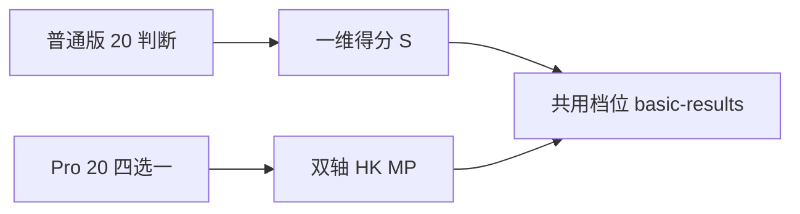

# 评测标准（普通版 + Pro 版）

版本：v0.2  
用途：描述**普通版（判断题）**与 **Pro 版（双轴四选一）**的分工、计分、共用结果档位与人工校准说明。  
状态：待人工补充与校对

**与工程一致时**：双轴计分与矩形匹配见 [`src/lib/basic-scoring.ts`](../../src/lib/basic-scoring.ts)；结果区间见 [`src/data/basic-results.ts`](../../src/data/basic-results.ts)（**78 分制**，以源码为准）。

---

## 0. 产品分层（文档口径）

| 名称 | 形态 | 计分 | 结果 |
| --- | --- | --- | --- |
| **普通版** | 每次 **20** 题，**全部为判断题**（对 / 错） | **一维线性**：单一标量得分 \(S\)（见 §1） | 与 Pro **共用**同一套 `resultId`、称号与解释口径（见 §3） |
| **Pro 版** | 每次 **20** 题，**四选一**，抽题与权值同当前工程（核心 6 + 补充 14） | **双轴**：历史了解程度 × 明朝偏向程度（见 §2） | 同上 |

说明：

- **「结果相同」**指对外**档位一致**（`objective-neutral`、`ming-leaning-moe` 等），内部得分向量不同；普通版经 **标定** 后落入与 Pro 相同的矩形语义。
- 留言板、资格校验等若写「完成普通版测评」，**目标行为**为：用户完成**普通版（判断）**或 **Pro** 任一套测验后，若得到允许的 `resultId`，均可发帖（与现有 `resultId` 白名单兼容）；**当前实现**若仅接一条测验路径，以代码为准，本文档只约定产品目标。

---

## 1. 普通版（判断题）

### 1.1 定位

最轻量入口：只区分陈述**对 / 错**，不做四选一强度梯度。用于快速筛史观倾向，与 Pro 共用同一套主结果，便于分享与资格统一。

### 1.2 评测目标（摘要）

与 Pro 双轴所服务的史观区分目标一致，见 §4 各档核心特点与 §5 中 Pro 的题材覆盖；普通版用**非对即错**减少选项博弈。

### 1.3 题目原则

- 每题**一条**可判真假的陈述，避免双命题、避免「对又不对」的绕口令。
- 每题在题库中标注 **标准答案**（对或错）及 **与标定方向一致** 的得分贡献（见 §1.4）。
- 语气可带讽刺，但避免一眼假或送分，以免 \(S\) 失去区分度。

### 1.4 一维得分 \(S\)

- 定义**单调**标量：例如未加权「与标准答案一致」的题数 \(0\!-\!20\)，或按**与 Pro 相同**的核心 / 补充权值加权后的等价分数 \(S_{\mathrm{w}}\)（推荐后者，便于与 Pro 分布对齐）。
- **单调性约定**：沿 \(S\) 增大方向，总体更接近「制度分析、材料取向」一侧（与 Pro 中偏向 **D 类**选项的方向一致）；具体每题的「对 / 错」与加分方向由题库表列出，实现时逐题配置。

### 1.5 档位映射（标定原则）

- 用 **分段阈值** 将 \(S\) 映射到 §3 的同一套 `BasicResultId`。阈值**不**与 Pro 的 78 分双轴混用，需单独标定。
- **建议流程**：小样本试测 → 与 Pro 人群**分位数对齐**或专家审读 → 迭代阈值；避免拍脑袋固定数字，除非已回放数据验证。
- **结果页展示（产品选项）**：仅展示档位与文案；或同时展示一维 raw 分 / 正确题数（需防用户简单刷对错关键词）。

### 1.6 与资格、统计

- 若统计与防刷仍使用「完成测试 + `resultId`」模型，普通版与 Pro 应写入**相同**的 `resultId` 枚举，以便首页分布、留言板白名单一致。

---

## 2. Pro 版（双轴四选一）

### 2.1 定位

在相同时长（20 题）下，用**四选一**保留立场强度梯度，双轴计分与现有实现一致，作为「进阶」路径；**不是**独立四维画像产品（原「四维 Pro」已废止，见 [`pro-evaluation-standard.md`](./pro-evaluation-standard.md) 附录）。

### 2.2 抽题与满分

**与当前工程一致时**（`src/data/basic-test-config.ts` 等）：每次随机抽 **20** 题，其中 **6** 道核心题（权值 2）、**14** 道补充题（权值 1）；**单轴理论满分 78**（\(6 \times 2 \times 3 + 14 \times 1 \times 3\)）。

### 2.3 双轴含义

- **历史了解程度**（`historyKnowledge`）
- **明朝偏向程度**（`mingPreference`）

每题 4 个选项，默认双维度分值如下（与 [`docs/详细设计/题库.md`](./题库.md) 表一致）：

| 选项 | 历史了解程度 | 明朝偏向程度 | 含义 |
| --- | --- | --- | --- |
| A | 0 | 3 | 强明粉 / 朱元璋梦男式判断 |
| B | 1 | 2 | 低了解但高明朝偏向 / 旧明粉式辩护 |
| C | 0 | 1 | 低了解、中等明朝偏向 / 教材式直觉 / 路人摇摆 |
| D | 3 | 0 | 倾向材料、机制和制度后果分析 |

单题得分 = 各维度分值 × **题目权值**。

### 2.4 计分实现说明

- 双轴累加见 `scoreBasicAnswers`。
- **首个匹配的矩形**即为基底结果，匹配顺序见 `BASE_TIER_MATCH_ORDER`（与 §3 表顺序一致）。

---

## 3. 共用结果档位（与 `basic-results.ts` 一致）

以下区间为 **78 分制**下单轴 **明朝偏向程度**（`mingPreference`）与 **历史了解程度**（`historyKnowledge`）的矩形；**以源码 [`basic-results.ts`](../../src/data/basic-results.ts) 为准**。文档旧稿中 72 分制与多档细分（如「完全不了解历史」「已经切割的旧明粉」）若未出现在源码矩形中，视为**尚未上线**或已合并，不再作为验收依据。

| 历史了解程度 | 明朝偏向程度 | `resultId`（基底） | 展示称号（示例） |
| --- | --- | --- | --- |
| 0–78 | 0–26 | `objective-neutral` | 客观中立 |
| 0–78 | 0–26 | `manchu-loyalist` | 满遗（`objective-neutral` 的 10% 展示变体） |
| 0–78 | 27–39 | `ming-leaning-moe` | 萌萌人 |
| 0–78 | 40–52 | `old-ming-fan` | 旧明粉 |
| 0–78 | 53–65 | `new-ming-fan` | 新明粉 |
| 0–78 | 66–78 | `zhu-yuanzhang-dreamer` | 朱元璋梦男 |

**匹配顺序**（先命中先退出）：`objective-neutral` → `ming-leaning-moe` → `old-ming-fan` → `new-ming-fan` → `zhu-yuanzhang-dreamer`。  
**满遗**：非独立基底档；与 `objective-neutral` 同区间，按 `displayChance` 随机展示为「满遗」，解释文案仍按客观中立理解。

**普通版**：将一维 \(S\) 标定到上表同一套 `resultId`（展示层与 Pro 共用组件即可）。

---

## 4. 各档核心特点（评测对象描述）

以下用于出题与人工校对时的「靶子」，称号以 §3 为准。

### 客观中立（及满遗彩蛋）

- 优先财政、货币、户籍、海禁、社会流动与国家能力等机制；不自动替洪武型财政、宝钞、海禁和强皇权辩护。
- 对「明史被满清篡改」等话术警惕；对明代缺点与制度成本有认识，不强烈偏向明朝。
- **满遗**：同一基底，娱乐向抬旗显示名，本质仍按客观中立解释。

### 萌萌人

- 对明朝有朴素好感（滤镜、人物、影视），缺乏系统洪武祖制辩护；细节题易选「不太懂」类立场（在 Pro 中常对应 B/C）。

### 旧明粉

- 明确情感偏向明代，愿部分辩护但仍可能承认制度代价；与新明粉相比尚未全套祖制护航。

### 新明粉

- 更系统维护明代制度，替洪武型财政、海禁等找合理性；对不利比较防御更强。

### 朱元璋梦男

- 强人格化维护朱元璋与洪武祖制；高防御宝钞、起义、海禁、明史叙事等议题。

---

## 5. Pro 版题目设计原则

- 每题只测一个主要判断，不做复合陷阱题。
- 选项从强认同到强反对逐级排列（展示时可乱序，计分按选项 id）。
- 区分立场强度，而非考冷门知识。
- 尽量覆盖财政、货币、宋明比较、海禁、强皇权、史观方法等主题。

---

## 6. 命中样本（Pro 四选一答题倾向）

### 客观中立

- 多数题倾向 D，少量 B 或 C。

### 满遗

- 与客观中立相同；仅展示名不同。

### 萌萌人

- C 与 B 较多，人物 / 气象题可能偏 A。

### 旧明粉

- B 较多，少量 A 与 C。

### 新明粉

- A 与 B 较多，洪武祖制相关题易选 A。

### 朱元璋梦男

- 大量 A，核心题高频命中。

（普通版判断题可日后补充「易错对与区分度」样本。）

---

## 7. 需要避免的误判

待补充：哪些人不应被判成朱元璋梦男；哪些题可能误伤客观中立。

---

## 8. 后续校准

- 各结果人数分布是否过度集中。
- 用户反馈题目是否过露或过偏。
- 普通版阈值与 Pro 分布对齐是否需再迭代。
- 「满遗」彩蛋比例是否仍合适。

---

## 附录 A：测验路径与共用档位（示意）

---

## 附录 B：旧稿 72 分制区间表

早期文档曾用「4 核心 + 16 补充」**72 分制**与更细的历史了解分段。**当前代码**为 **78 分制**与 §3 矩形。若需从旧表换算边界，可使用 ×\(78/72\) 比例，但最终以 `basic-results.ts` 为准。
